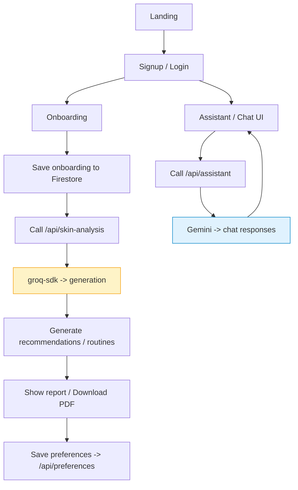

# Advaitha — AI-Powered Skincare MVP

Live demo: REPLACE_WITH_LIVE_DEMO_URL

Simple, production-like MVP built with Next.js, Firebase, and Google Gemini for AI features.

**Project goal:** Personalised skin analysis and routine suggestions based on user onboarding data.

**Stack:** Next.js (App Router), React, Tailwind CSS, Firebase (Auth, Firestore), Gemini (Generative AI), groq-sdk, jsPDF.

**What this README covers**

- Quick start
- Folder structure
- High-level flow (diagram)
- Key technical decisions
- State management note (Zustand)
- Environment variables

**Quick start**

1. Install dependencies:

```bash
npm install
```

2. Run dev server:

```bash
npm run dev
```

3. Open http://localhost:3000

**Folder structure**

```
frontend/
├─ app/
│  ├─ api/                # Next.js API routes (assistant, preferences, products, skin-analysis)
│  ├─ components/         # Shared UI components (header.js, footer.js, ChatWidget.js, LeafBackground.js)
│  ├─ onboarding/         # Onboarding flow pages
│  ├─ skin-analysis/      # Skin analysis UI
│  ├─ settings/           # Settings & preferences UI
│  └─ page.js             # Landing page
├─ lib/
│  ├─ firebase/           # Firebase init, auth, firestore helpers
│  ├─ gemini/             # Gemini client wrapper
│  └─ groq/               # groq client wrapper
├─ public/                # Static assets (images, icons)
├─ package.json
└─ README.md
```

**High-level flow**

Mermaid flow (replace or view in a renderer):



Flow summary:

- User registers or logs in (Firebase Auth).
- They complete onboarding (skin type, diet, sensitivity) stored in `users/{uid}`.
- The frontend calls `/api/skin-analysis` with `uid`.
- Server reads onboarding data and calls groq to generate a personalized report.
- Report is shown in the UI and can be downloaded as PDF.
- Preferences can be saved and changed via `/api/preferences` to a Firestore collection keyed by uid.

**Key technical decisions**

- Next.js App Router: page components are colocated with UI and API routes live under `app/api`.
- Firebase Firestore: primary DB for user onboarding and preferences; Realtime/Firestore SDK is used.
- Gemini (Generative AI): used server-side to generate skin recommendations.
- groq-sdk: included as an alternate client to interact with generative services.
- jsPDF: used client-side to export analysis reports as PDF.

**State management**

- Local state uses React `useState` for per-page state.
- Global toggle: we use **Zustand** for the hamburger menu state in `app/components/header.js`. The header uses a small Zustand store to persist the `isOpen` boolean across header components and make the hamburger responsive and simple.

Example note: See `app/components/header.js` for the hamburger implementation using Zustand.

**API routes**

- `POST /api/skin-analysis` — Reads onboarding data from `users/{uid]}`, calls **groq-sdk** server-side to generate the personalized skin recommendations and routines, and returns the analysis.
- `POST /api/preferences` — Saves user preferences to `preferences/{uid}` in Firestore.
- `POST /api/assistant` — Chat / assistant integration: server-side **Gemini** calls to generate responses for chat and assistant features.

**Environment variables**

Add a `.env.local` with (example):

```
GROQ_API_KEY=your_groq_key
GEMINI_API_KEY=your_gemini_key
NEXT_PUBLIC_FIREBASE_API_KEY=...
NEXT_PUBLIC_FIREBASE_AUTH_DOMAIN=...
FIREBASE_PROJECT_ID=...
```

**Deployment**

- App is compatible with Vercel. Ensure environment variables are set in the deployment platform.

**Testing & verification**

- Dev: `npm run dev` and test flows: signup → onboarding → skin analysis → download PDF.

---
